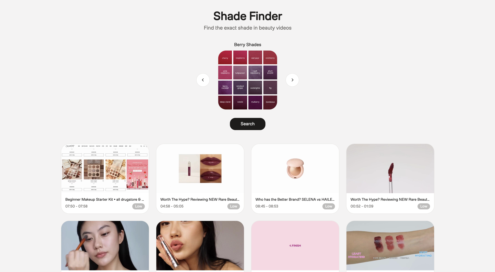

<a id="readme-top"></a>

# Shade Finder

## 👋 Introduction

Shade Finder is an app designed to pinpoint moments in beauty and fashion videos where specific shades appear. Whether you're looking to identify products with particular colors or simply want to explore the hues that catch your eye, Shade Finder is your perfect companion!

Powered by [Twelve Labs Image to Video Search](https://docs.twelvelabs.io/sdk-reference/node-js/search), the app excels at finding videos featuring objects, colors, and shapes that closely match the images you provide. Ideal for beauty enthusiasts and fashion aficionados, Shade Finder ensures you never miss a moment of your favorite shades in action.

⭐️ Check out the [Demo](https://shade-finder-vercel-client.vercel.app/)!

<div align="center">
  <a href="https://shade-finder-vercel-client.vercel.app/">
    
  </a>
</div>

### Built With

- [JavaScript](https://developer.mozilla.org/en-US/docs/Web/JavaScript)
- [Node](https://nodejs.org/en)
- [Twelve Labs Node.js SDK](https://www.npmjs.com/package/twelvelabs-js) (v1.2.1)
- [HLS.js](https://github.com/video-dev/hls.js/) (video streaming)
- [Tailwind CSS](https://tailwindcss.com/) with [Strand Design System](https://github.com/mrnkim/strand)

## 🔑 Getting Started

### Step 1. Generate Twelve Labs API Key

Visit [Twelve Labs Playground](https://playground.twelvelabs.io/) to generate your API Key

- Once you sign up, you'll receive complimentary credits allowing you to index up to 10 hours of video content!

### Step 2. Start the App Locally

1. Clone the current repo

   ```sh
   git clone git@github.com:mrnkim/shade-finder.git
   ```

2. Open `.env` file in the `backend` directory and update the values for each key

   ```
    .env

    TWELVE_LABS_API_KEY=<YOUR_API_KEY>
    TWELVE_LABS_INDEX_ID=<YOUR_INDEX_ID>
   ```

3. Start the server (\* This app runs on port 5001.)

   ```sh
   node server.js
   ```

4. Open http://localhost:5001 in your browser

<p align="right">(<a href="#readme-top">back to top</a>)</p>
